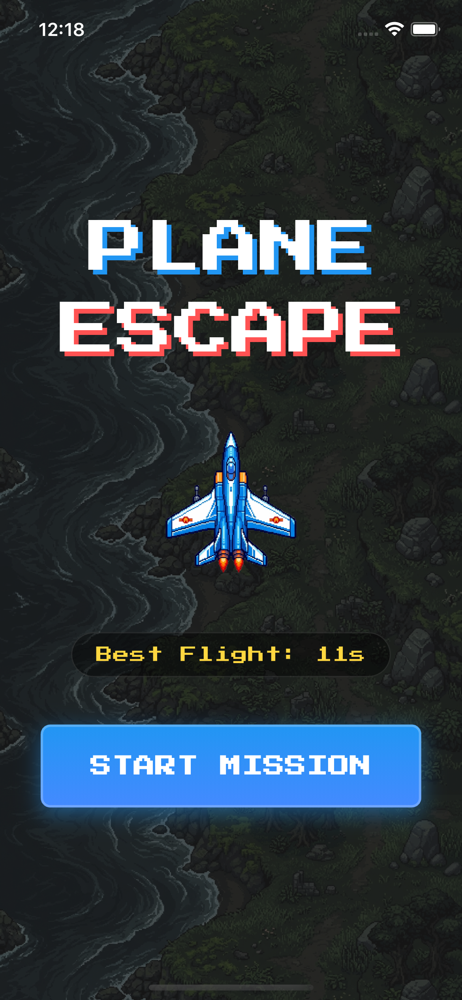
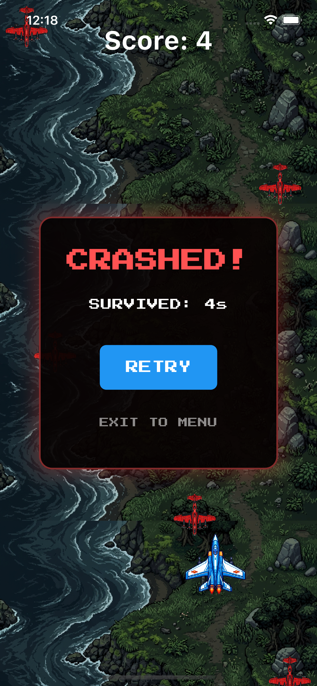

# Plane Escape ✈️

**Plane Escape** is a high-octane, endless arcade dodging game built with Flutter and the Flame engine. Take control of a high-speed jet, navigate through a barrage of enemy bombers, and push your survival skills to the limit in this pixel-perfect retro experience!

---

## 📸 Screenshots

| Start Menu | Gameplay | Game Over |
|:---:|:---:|:---:|
|  |  |  |

---

## 🎥 Video Demonstration
<video src="screenshots/plane_escape.mp4" controls width="50%" height="50%"></video>

---

## 🚀 Features

- **Endless Flight**: The mission only ends when you crash. How long can you survive?
- **Intuitive Controls**: Smooth horizontal dragging optimized for mobile play.
- **Pixel Art Aesthetics**: Procedurally inspired pixel art assets for a true 90s arcade vibe.
- **Parallax Background**: Immersive scrolling terrain that simulates high-altitude flight.
- **High Score Persistence**: Tracks your "Best Flight" time using local storage.
- **Fully Polished UI**: Narrative-driven Main Menu, Pause, and Game Over overlays with arcade typography.

---

## 🕹️ How to Play

1. **Launch the Mission**: Press "START MISSION" from the Main Menu.
2. **Evade**: Drag your finger left or right to move the plane.
3. **Avoid Collisions**: Crashing into red enemy bombers results in an immediate Game Over.
4. **Beat Your Best**: Your score increases the longer you stay in the air. Can you set a new record?

---

## 🛠️ Tech Stack

- **Framework**: [Flutter](https://flutter.dev)
- **Game Engine**: [Flame](https://flame-engine.org)
- **Fonts**: [Google Fonts](https://pub.dev/packages/google_fonts) (Press Start 2P)
- **Persistence**: [shared_preferences](https://pub.dev/packages/shared_preferences)
- **Assets**: Custom generated pixel-art sprites.

---

## 📥 Installation

1. **Clone the repository**:
   ```bash
   git clone <repository-url>
   cd plane_escape
   ```

2. **Install dependencies**:
   ```bash
   flutter pub get
   ```

3. **Run the game**:
   ```bash
   flutter run
   ```

---

## 📜 Credits

Created with ❤️ using Flutter & Flame.
